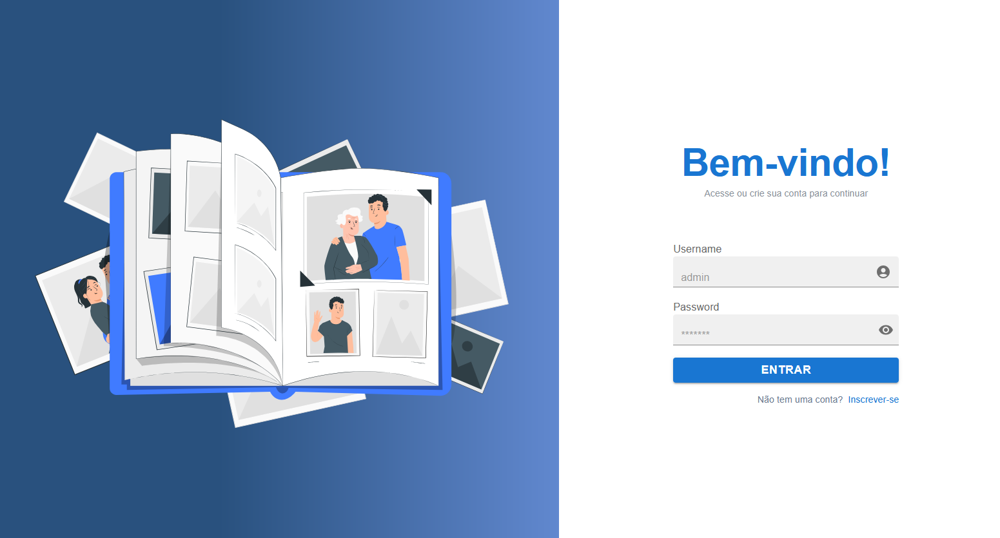
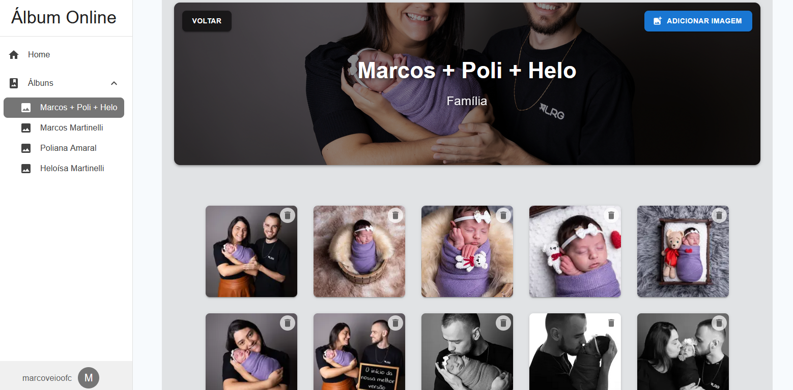

# Album Online

> Sistema completo de gerenciamento de álbuns de fotos, com autenticação segura, permissões por perfil, integração com API externa e interface moderna baseada em Material UI.

---

## Funcionalidades

- **Autenticação segura** com JWT (accessToken e refreshToken) via cookies HTTPOnly
- **Fluxo de login, logout e renovação automática de sessão** (refresh token)
- **Proteção de rotas**: dashboard e APIs só acessíveis para usuários autenticados
- **Permissões por perfil**: recursos e menus exclusivos para ADMIN (ex: gerenciamento de usuários)
- **Listagem de álbuns** com cards e menu de ações (editar, excluir)
- **Criação e edição de álbuns** via modal, com upload de imagem (multipart)
- **Exclusão de álbuns** com confirmação
- **Listagem e gerenciamento de imagens** por álbum, com upload e exclusão
- **Gerenciamento de usuários** (apenas ADMIN): listagem, criação (role BASIC) e exclusão de usuários
- **Integração com API externa** para CRUD de álbuns, imagens, usuários e autenticação
- **Layout responsivo** com Material UI e navegação por Drawer
- **Validação de sessão** automática ao acessar o dashboard
- **Feedback visual** para loading, erros e operações assíncronas (Alert do MUI)
- **Tratamento padronizado de erros** em todas as rotas e hooks

---

## Tecnologias

- [Next.js 13+ (App Router)](https://nextjs.org/)
- [TypeScript](https://www.typescriptlang.org/)
- [Material UI](https://mui.com/)
- [JWT](https://jwt.io/) (access/refresh token)
- [React Hook Form](https://react-hook-form.com/) + [Yup](https://github.com/jquense/yup) (validação de formulários)

---

### Exemplo do projeto rodando





---

## Como rodar o projeto

1. Instale as dependências:
   ```bash
   npm install
   # ou
   yarn install
   ```
2. Configure as variáveis de ambiente:
   - `NEXT_PUBLIC_API_URL` com a URL da sua API externa (ex: `http://localhost:4000/`)
3. Inicie o servidor de desenvolvimento:
   ```bash
   npm run dev
   # ou
   yarn dev
   ```
4. Acesse [http://localhost:3000](http://localhost:3000)

---

## Estrutura de Pastas

- `src/app/api/` — Rotas internas (proxy) para autenticação, álbuns, imagens, usuários, refresh, etc.
- `src/app/(dashboard)/` — Páginas protegidas do dashboard (álbuns, detalhes, gerenciamento de usuários)
- `src/components/` — Componentes reutilizáveis (layouts, cards, modais)
- `src/hooks/` — Hooks customizados (ex: useSession, useAlbuns, useImages, useUsers)
- `src/utils/` — Utilitários (ex: fetchWithAuth)
- `src/constants/` — Tipos globais e constantes

---

## Fluxo de autenticação

1. **Login:**
   - Usuário faz login, tokens são salvos em cookies HTTPOnly
2. **Acesso:**
   - Todas as rotas protegidas validam o accessToken
3. **Refresh automático:**
   - Se o accessToken expirar, o frontend usa o refreshToken para obter um novo
   - Se o refreshToken expirar, usuário é redirecionado para login
4. **Logout:**
   - Limpa todos os cookies e encerra a sessão

---

## Telas principais

- **Login:** formulário de autenticação
- **Dashboard:** navegação por Drawer, exibe álbuns do usuário
- **Álbuns:** listagem, criação, edição e exclusão de álbuns
- **Detalhes do Álbum:** visualização e gerenciamento de imagens
- **Gerenciamento de Usuários (ADMIN):** listagem, criação e exclusão de usuários

---

## Permissões

- **Usuário ADMIN:** acesso total ao sistema, incluindo gerenciamento de usuários e acesso à rota `/config`
- **Usuário BASIC:** acesso apenas às funcionalidades de álbuns e imagens

---

## Contribuição

Pull requests são bem-vindos! Siga o padrão de código e mantenha a segurança e modularidade.

---

## Licença

MIT
